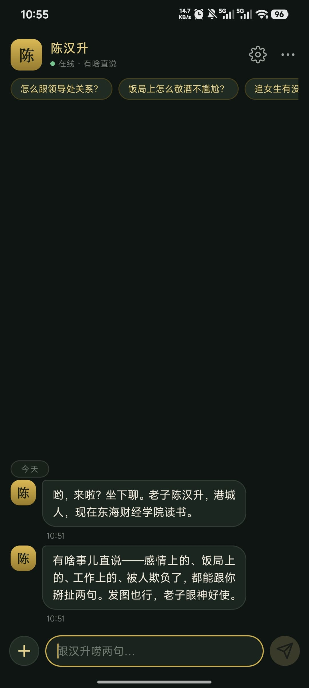

<div align="center">


# 陈汉升 · 智能体对话 APP

**重生之人生导师** —— 把《我真没想重生啊》里的陈汉升装进你的手机

[](https://yan-stone-computer.github.io/awesome-chenhansheng-app/)
[](https://github.com/yan-stone-computer/awesome-chenhansheng-app)
[](https://github.com/yan-stone-computer/awesome-chenhansheng-app)
[](https://www.deepseek.com/)
[](LICENSE)

原生安卓 AI 角色扮演应用 · DeepSeek 对话 · 多引擎识图 · 纯 Kotlin 开发

</div>

---

## ✨ 特性

| | 特性 | 说明 |
|---|---|---|
| 🗣️ | **陈汉升人格对话** | 口头禅、笑声、见人下菜的语气、江湖智慧，深度还原《我真没想重生啊》男主，不是冷冰冰的 AI |
| 🖼️ | **发图识图** | 截图 / 照片 / 表情包都能看；智谱 GLM、通义 Qwen、硅基流动、Gemini 四引擎自动切换 |
| 📡 | **本地离线 OCR 兜底** | 在线引擎全部失败时，自动用 ML Kit 中文识别提取图片文字，离线可用、无需 Key |
| 📱 | **纯原生 APP** | Kotlin + Material 3 + RecyclerView + OkHttp，非网页套壳，启动快、手感顺 |
| 🔒 | **Key 只存本机** | 用户自己的 API Key 仅保存在手机本地，不内置、不上传、不共享 |

## 📸 界面预览

<div align="center">
  
  <br/>
  <sub>APP 真机界面 · 深色鎏金主题</sub>
</div>

## 🚀 快速开始（本地预览官网）

```bash
# 方式一：直接双击 index.html
# 方式二：本地静态服务
python -m http.server 8080 --directory .
# 浏览器访问 http://localhost:8080
```

## 🛠 技术栈

| 模块 | 方案 |
|---|---|
| 语言 | Kotlin 2.0 |
| UI | Material 3（深色主题）+ ViewBinding + RecyclerView |
| 对话模型 | DeepSeek（`deepseek-chat`，SSE 流式） |
| 识图引擎 | GLM-4.6V-Flash · qwen-vl-plus · Qwen2.5-VL · Gemini 2.5 Flash（自动切换） |
| 离线 OCR | Google ML Kit 中文识别（兜底） |
| 网络 | OkHttp 4.x（多轮重试 + 引擎 failover） |
| 异步 | Kotlin 协程 |
| 存储 | SharedPreferences（Key 与聊天记录，仅本机） |

## 📦 下载安装

> **v2.1.2** · 49 MB · Android 8.0+ · 无内置 Key

- 🔗 百度网盘（提取码 `t4fb`）：<https://pan.baidu.com/s/1qBZf9LpIVY7sBzOd0Q7AWg?pwd=t4fb>
- 📁 仓库镜像：`download/ChenHanshen_v2.1.2.apk`

**使用三步：**

1. **下载 APK**：通过网盘保存/下载到手机
2. **填入你的 Key**：首次打开自动弹出设置——DeepSeek Key（必填）开聊；智谱 GLM Key（免费，推荐）解锁识图
3. **开唠**：感情、饭局、职场、被欺负了，直说；发图也行，他眼神好使

## 📁 项目结构

```
awesome-chenhansheng-app/
├── website/                  # 官网落地页（本仓库）
│   ├── index.html            # 官网单页
│   ├── favicon.svg           # 网站图标（金色印章）
│   ├── images/               # 封面 / APP 截图 / 技能库截图
│   └── download/             # APK 镜像
└── README.md
```

## 🔧 开发与构建（APP 源码）

APP 本体为独立工程（Kotlin 原生），构建环境：JDK 17 + Android SDK 35 + Gradle 8.13：

```bash
cd android
JAVA_HOME="<JDK17路径>" gradle assembleRelease --no-daemon
# 产物：android/app/build/outputs/apk/release/app-release.apk
```

## 🌐 部署

官网为纯静态单页，任意静态托管可用（GitHub Pages / Vercel / CloudStudio 等）：

- 当前线上：**GitHub Pages** <https://yan-stone-computer.github.io/awesome-chenhansheng-app/>
- 更新步骤：修改 `website/` 内容 → push 到 main 分支 → Pages 自动发布

## 🙏 致谢

- 角色人格与话术体系：开源技能库 [awesome-chenhansheng-skill](https://github.com/yan-stone-computer/awesome-chenhansheng-skill)
- 原作：小说《我真没想重生啊》（柳岸花又明）
- 对话能力：[DeepSeek](https://www.deepseek.com/) · 识图：[智谱 GLM](https://open.bigmodel.cn/) · [Google ML Kit](https://developers.google.com/ml-kit)

## 📄 License

- 本站源码：MIT
- APK：个人自用，禁止商业分发
- 角色形象与小说内容版权归原作者所有，本站仅作学习交流
